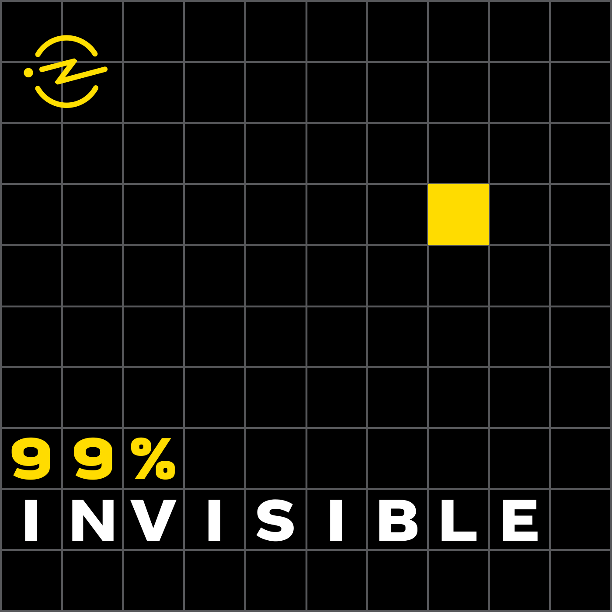
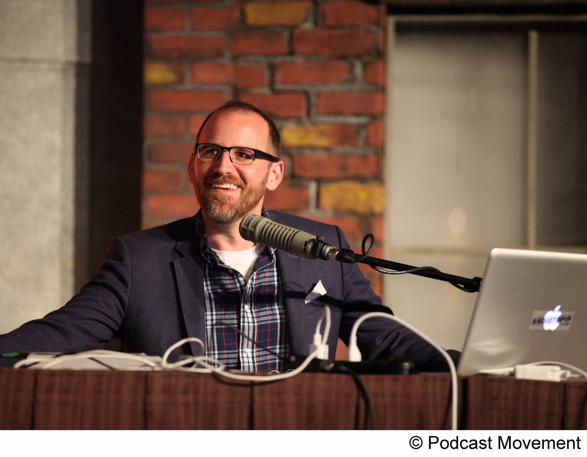
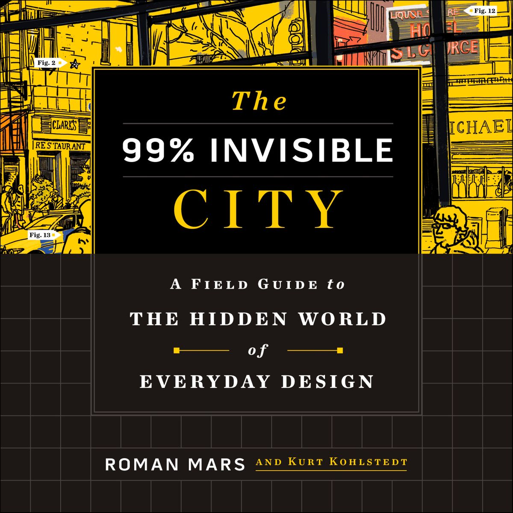

# My Favorite Podcast - 99% Invisible

### About
99% Invisible is about all the thought that goes into the things we don’t think about — the unnoticed architecture and design that shape our world. With over 400 million downloads, 99% Invisible is one of the most popular podcasts on iTunes and is available on RadioPublic, via RSS and through other apps.
99% Invisible started as a project of KALW public radio and the American Institute of Architects in San Francisco. Originally, host and creator Roman Mars produced 99% Invisible from his bedroom. Roman Mars is also a founding member of the podcast collective, Radiotopia.

### Roman Mars
You might be surprised to learn that Roman Mars does not hold a degree in architecture or design. He actually studied plant population genetics. It’s a long story. Nevertheless, Fast Company named Mars one of the 100 Most Creative People in 2013 and he was a TED main stage speaker in 2015. He produced the most successful crowdfunding campaigns for a podcast in Kickstarter history, and he continues to captivate listeners everywhere as the creator and host of 99pi.

### Upcoming Book
Introducing our beautifully designed and illustrated guide to the built world, already a New York Times Best Seller. Order the book today on Amazon, Barnes & Noble, Bookshop or Indiebound (internationally: the UK, Canada and Australia). The audiobook version read by Roman Mars is also available on Audible and Libro.fm. Also, a limited number of signed copies are in stock at Barnes & Noble!

[99PI Site](https://99percentinvisible.org/)